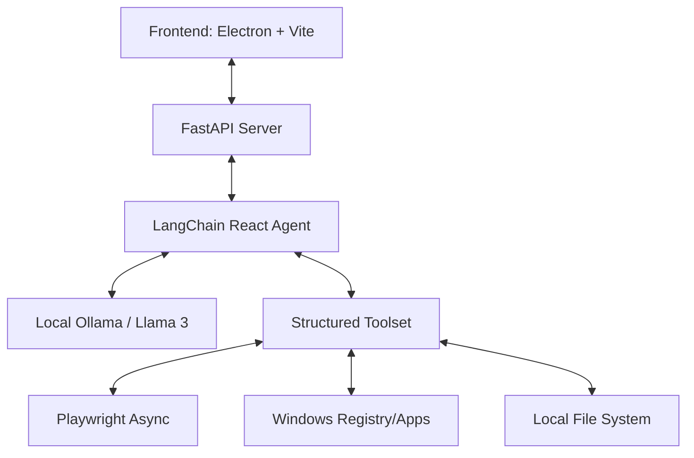

# ARCHITECTURE OVERVIEW (ARCHITECTURE.md) - AutoFlow Cognitive Assistant

## 🏗️ System Overview
The system follows a structured **Client-Server Architecture** for local Windows automation.

## 🧩 Core Components
### 1. **The Backend (FastAPI)** (`main.py`)
Provides the control layer for the AI agent, handles browser sessions, and manages the local LLM interaction.

### 2. **The Frontend (Electron + Vite)** (`ui/`)
The user interface designed for interaction with the agent. Currently features text-based chat and (previously) voice controls.

### 3. **The Agent (LangChain)** (`main.py`)
The "brain" of the system, leveraging LLM reasoning to choose between tools and execute tasks.

### 4. **The Tools (Structured Python)** (`main.py`)
-   `action_web_*`: Comprehensive browser automation tools using Playwright.
-   `action_list_installed_apps`, `action_open_local_app`: Native Windows integration.
-   `action_write_file`, `action_find_file`: File system manipulation.

## 💾 Core State Management
-   **Conversation Memory**: `ConversationBufferWindowMemory` (FastAPI side).
-   **Browser Session**: `BrowserManager` (Playwright launch/persistence).
-   **Persistence**: `browser_profile/` (persist Chrome sessions).

## 🚀 Execution Flow
1.  **Request**: User sends a prompt through the UI.
2.  **Reasoning**: LangChain Agent evaluates the prompt using Llama 3.
3.  **Tool Selection**: Agent picks one or more tools (Browser, FS, Apps).
4.  **Execution**: Tool interacts with the OS or web.
5.  **Feedback**: Result is fed back to the LLM for the next step or final response.

## 🏁 Future State (Post-Voice Removal)
-   Removal of `vosk_model`, `setup_vosk.py`, and related dependencies.
-   Refinement of the agent's system prompt (`ROBOT_PREFIX`) for higher precision.
-   Implementation of "Search-First" for web tasks to save context/tokens.

---
**Status: UPDATED**
**Date: 2026-03-28**
